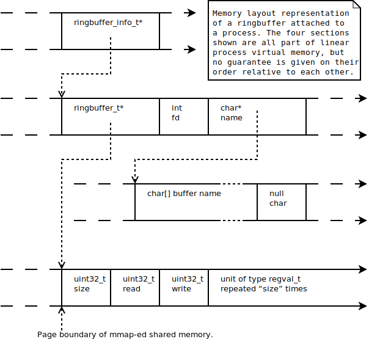
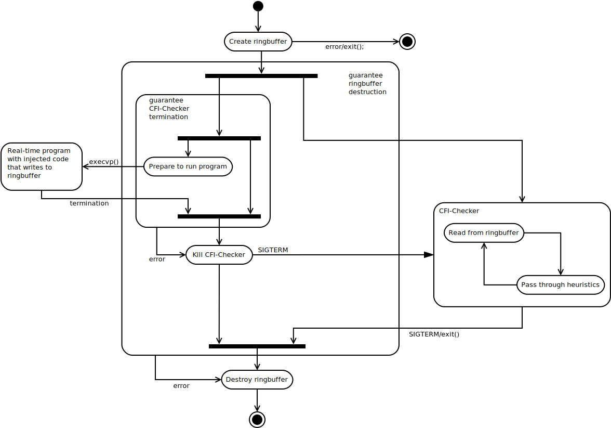

# ECFI-178B
Backward Edge Control Flow Integrity for Real-Time Embedded Systems

## Prerequisites
A (non-exhaustive) list of software necessary to build the project

- gcc
- make
- doxygen (optional, documentation)
- graphviz (optional, documentation)
- valgrind (optional, memory usage analysis)

## Building
```bash
make
```

## Testing
To compile and test the ringbuffer library:
```bash
make runtests
```
To compile and test the CFI executable:
```bash
    LD_PRELOAD=bin/lib/libringbuffer.so bin/cfi-checker bin/cfi-test
```

## Running
```bash
    LD_PRELOAD=bin/lib/libringbuffer.so bin/cfi-checker <path to executable>
```

## Architecture ##
Memory layout for ring buffer:

Activity diagram of the CFI-Checker.


## Optimisation points:
- Use thread instead of separate process for the checker
- Assume library calls are well-behaved and remove certain checks in ringbuffer.c:rb\_read()

## Known issues:
- rb_destroy is too aggressive. This will cause problems in certain cases. Needs to be fixed.
- Check correct memory usage of structs (maybe use offsetof)
- If the checker is aborted it may be necessary to manually delete the ringbuffer: ```rm /dev/shm/rb_cfi_*```
