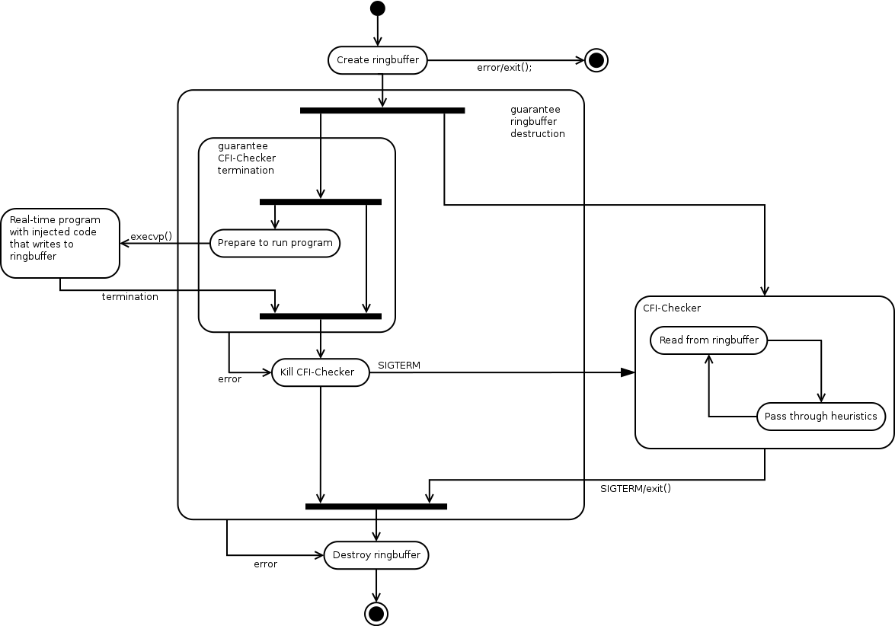

# ECFI-178B
Backward Edge Control Flow Integrity for Real-Time Embedded Systems

## Prerequisites
A (non-exhaustive) list of software necessary to build the project

- gcc
- make
- python3-pydot
- doxygen (optional, documentation)
- graphviz (optional, documentation)
- valgrind (optional, memory usage analysis)

## Building
```bash
make
```

### Compile to assembly ###
To compile to assembly (for example the BOF4.c file) and then to binary:
```bash
make asm/[name of the file].s
```

### Compile to binary ###
To compile to assembly (for example the BOF4.c file) and then to binary:
```bash
make asm_to_bin/[THE-File-Name]
```

### Cross compiling
Override the CC variable on the command line with your cross compiler:
```bash
make CC=arm-linux-gnueabihf-gcc bin/BOF4
```

## Testing
To compile and test the ringbuffer library:
```bash
make runtests
```
To test the record write/verify functionality:

1. Open src/cfi-checker.c
2. Comment lines 28 and 30. (cfi_print and cfi_check_record)
3. Uncomment line 29 (cfi_record)
4. Compile and run once:
    <pre><code>make -B bin/cfi-checker bin/injection-test
    LD_PRELOAD=bin/lib/libringbuffer.so bin/cfi-checker bin/injection-test</code></pre>
5. Open src/cfi-checker.c again.
6. Comment line 29 (cfi_record)
7. Uncomment line 30 (cfi_check_record)
8. Compile again.
9. Run again.
10. Check the files checker.out and checker.err for messages. If there are no errors, the check succeeded. If the behaviour was different at some point, you will be show a summary of the differences.

To compile and test the BOF4 executable:
```bash
make asm_to_bin/[filename]
LD_PRELOAD=bin/lib/libringbuffer.so bin/cfi-checker bin/BOF4
```

## Debugging
To load the cfi-checker injection test in gdb, with debug symbols:
```bash
./gdb.sh asm_to_bin/Filename
```
To end up in the right process, you may have to `set follow-fork-mode child` at an appropriate point in gdb.

## Running
```bash
make -B all
LD_PRELOAD=bin/lib/libringbuffer.so bin/cfi-checker <path to executable>
```

## Generate Dot File CFG from ANGR ##
To generate CFG using angr, both angr and angrutils are required. It is recommended to install these in a virutalenv. The example below assumes that they are installed in a virtualenv named _angr_.
The angr install through pip may return an error due to a bug in libcapstone. To fix this problem, search for libcapstone in the file tree indicated by the installer, and move it to the location where the installer says it is missing. 
After the installation of both angr and angrutils, change the visualize.py code of angrutils with the modified angrutils code that generates CFG dot files instead of PNG files. To generate the dot file:
```bash
workon angr
ipython
```
Then in iPython:
```python
import angr
from angrutils import *
proj = angr.Project("BOFM", load_options={'auto_load_libs':False})
main = proj.loader.main_bin.get_symbol("main")
start_state = proj.factory.blank_state(addr=main.addr)
cfg = proj.analyses.CFGAccurate(fail_fast=True, enable_symbolic_back_traversal=True, starts=[main.addr], initial_state=start_state)
plot_cfg(cfg, "ais3_cfg", asminst=True, remove_imports=True, remove_path_terminator=True)  
```
The plot CFG will generate a file named test.dot which is the dot file of the CFG for the binary.

## Architecture ##
Memory layout for ring buffer:


Activity diagram of the CFI-Checker.



### ASLR compensation ###
The injected set-up code from injectioncode/Call-C-Function-Setup.s calls the function cfg_setup() from include/ringbuffer.h and passes two arguments.
These arguments are:
# The address of main() during injection.
# The address of main() at run-time.
These two are used to calculate the offset between the addresses in the cfg and the addresses at runtime. This offset is stored in the global variable cfg_offset.

### Hotsite ID ###
The hotsite ID is a number given to a location where code is injected into the assembly. The hotsite ID is used to determine where in the CFG the execution is.
The hotsite ID is a multiple of 8, plus a suffix of 0-7. The hotsite ID is stored in the binary CFG, but the last three bits are all zeroes in there.
The lowest three bits of the hotsite are used to determine the type of the control flow transfer. With three bits, currenlty eight different transfers can be
distinguished, but only two are used so far:
 0 - Indirect branch (BLX <something>)
 1 - Return from a function (function epilogue)

### Binary CFG ###
The binary CFG used at runtime is defined in include/cfg.h and shown in diagrams/binary-cfg.svg

### CFG Checking ###
The function _checker_ in cfi-checker.c continuously reads data from the ringbuffer when available. It passes this data to a number of functions.
Currently these are:
- cfi_print (just prints ringbuffer data to stdout, which is redirected to the file checker.out) Used for debugging.
- cfi_record (literally record the contents of the ringbuffer during execution to a file name _record_)
- cfi_check_record (check the literal record in the file _record_ and print to stderr (redirected to checker.err) if it doesn't match exactly)
- cfi_validate_forward_edge (check whether the loaded cfg contains a valid entry for the passed hotsite ID and target. UNFINISHED)

cfi_validate_forward_edge calls the cfg_validate_jump function from src/cfg.c which does this:

(NOTE: Part of this is broken at the moment)

Iterate over all cfgblock structs in the cfg struct:

If the hotsite ID (minus the lowest three bits (transfer type identification)) of the current cfgnode matches the hotsite argument that was passed:

Iterate over the post_data in the cfgnode struct, and declare the transfer valid if a match is found.
Otherwise declare the transfer invalid.

If after reaching the end of the binary CFG, no matching cfgnode is found, the transfer is declared invalid too.

## Recommendations for my successor. ##
The current problem is to get the correct _target_ (aka. post_data) values in the binary CFG:
Ali has suggested that after the RBWriteInjector.run() call in injector.py:
1. Grab the set of function names: `set(injector.funcs.keys()`
2. Compile the _outfile_
3. Run the resulting binary in gdb:
   `import subprocess`
   `gdb = subprocess.Popen(['gdb', '<name-of-binary>'])`
4. Use `gdb.communicate()` to query the addresses for each function in the binary.
5. Also query gdb for the value of the global variable `cfg_offset` (note, step a few times, it's set in the first function call in `main()`.
6. For each CFGNode in injector.nodes:
   Find the functions that it can jump to in the CFG.
   Write the function address MINUS the value of _cfg.offset_ for these functions to CFGNode.post_nodes
7. Write the binary CFG data to file.
8. Change cfg.c:validate_jump to subtract the global cfg.offset from the target value before comparison with the values in the binary cfg.
## Optimisation points:
- Use thread instead of separate process for the checker

## Known issues:
- rb_destroy is too aggressive. This will cause problems in certain cases. Needs to be fixed.
- Check correct memory usage of structs (maybe use offsetof)
- If the checker is aborted it may be necessary to manually delete the ringbuffer: ```rm /dev/shm/rb_cfi_*```
- Ring buffer is (world?) writable.
- Ringbuffer administration has critical sections. Need to verify whether violating them only causes data loss, or invalidates program invariants.

## Real-Time Features:
- Priority handling using Ringbuffer
- Lock free implementation
- Formally verifiable hard Real-Time in the injected code.

## Todo:
C function for injection:
- get previous frame pointer
- calculate function arguments
- calculate stack pointer

ANGR:
- Function arguments in CFG.
